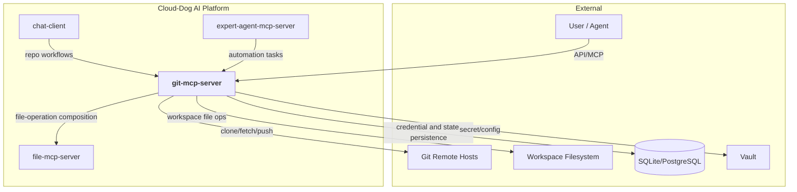
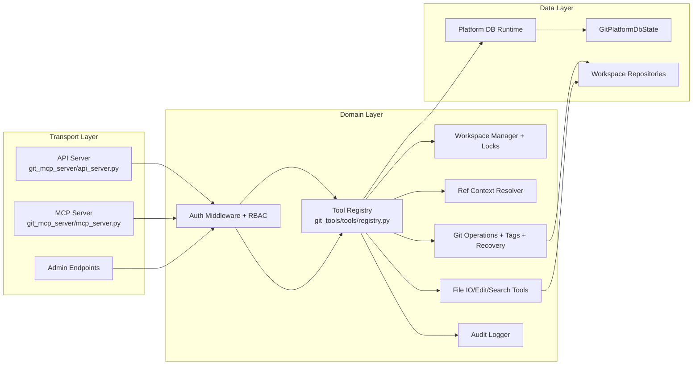
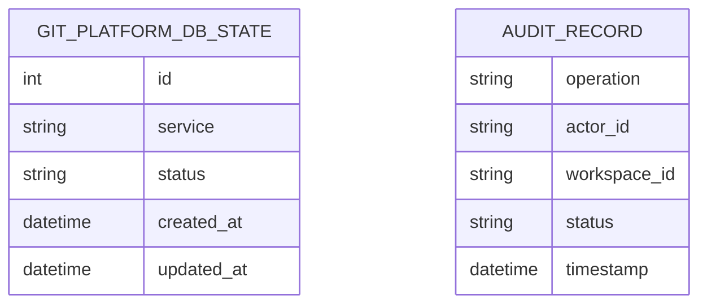
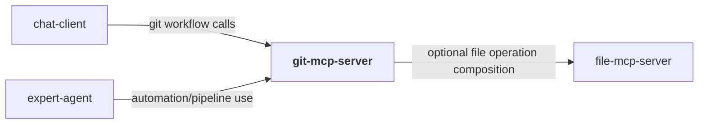
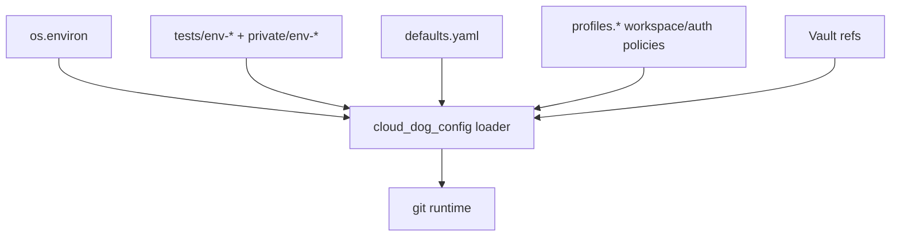
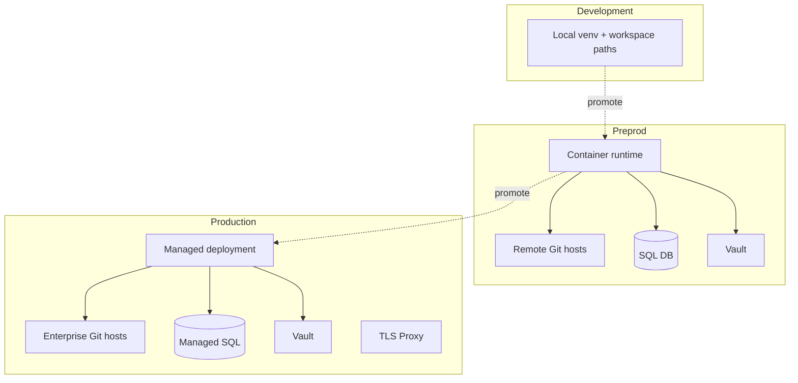
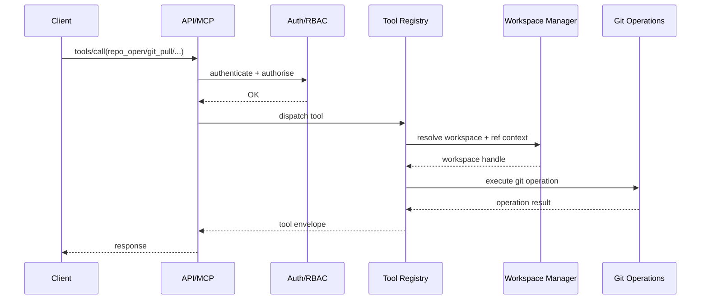
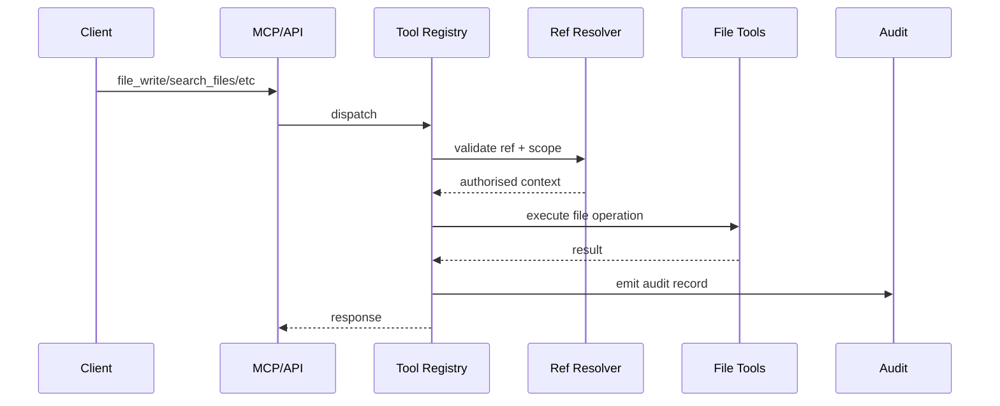

# Git MCP Server — Architecture

## 1. Overview
`git-mcp-server` provides controlled Git and branch-scoped file operations through API and MCP interfaces. It combines repository lifecycle controls, ref-context enforcement, file editing/search tooling, and admin profile/RBAC management.

The design separates transport adapters (`git_mcp_server`) from reusable domain tooling (`git_tools`), enabling consistent behaviour across API and MCP calls while preserving strict workspace and policy boundaries.

It is a platform utility service used by orchestrators and automation clients that need safe repository operations under role-based governance.

## 2. System Context Diagram

`git-mcp-server` is the platform's guarded Git execution boundary, enforcing policy and scope on all repository/file actions.

## 3. Component Architecture

The registry-centric model ensures all API/MCP calls share the same ref-scope, RBAC, and audit enforcement.

## 4. Module Decomposition
| Module | Path | Responsibility | Platform Package |
|---|---|---|---|
| API server | `src/git_mcp_server/api_server.py` | Canonical and legacy API routes, A2A health, admin routers | `cloud_dog_api_kit` |
| MCP server | `src/git_mcp_server/mcp_server.py` | `/mcp/tools` transport and tool dispatch | `cloud_dog_api_kit` |
| Auth runtime | `src/git_mcp_server/auth/middleware.py` | AuthN/AuthZ middleware wiring | `cloud_dog_idam` |
| Admin API | `src/git_mcp_server/admin/endpoints.py` | Profile CRUD and admin controls | — |
| Tool registry | `src/git_tools/tools/registry.py` | Tool definitions and execution handlers | — |
| Git domain | `src/git_tools/git/*` | Status/log/diff/branch/merge/rebase/stash/tag/recovery operations | — |
| Workspace domain | `src/git_tools/workspaces/*` | workspace lifecycle, lock, ref-resolution policies | — |
| File domain | `src/git_tools/files/*` | branch-scoped file read/write/edit/search helpers | — |
| Security domain | `src/git_tools/security/*` | RBAC and git auth helpers | `cloud_dog_idam` |
| DB runtime/models | `src/git_tools/db/runtime.py`, `src/git_tools/db/models.py` | DB health/init and state table | `cloud_dog_db` |
| Config/audit | `src/git_tools/config/*`, `src/git_tools/audit/*` | config loading and audit emission | `cloud_dog_config`, `cloud_dog_logging` |

## 5. Data Model

Relational persistence currently tracks platform DB runtime state; operational workspace, Git metadata, and audit state are managed by domain components and logs.

## 6. Interface Specifications
### 6.1 REST API
| Method | Path | Description | Auth |
|---|---|---|---|
| GET | `/health` | Service health | None |
| GET | `/a2a/health` | A2A health compatibility | API key |
| GET | `/app/v1/tools` | Tool catalogue | API key/JWT |
| POST | `/app/v1/tools/{tool_name}` | Tool execution | API key/JWT |
| GET | `/api/v1/tools` | Legacy tools list | API key/JWT |
| POST | `/api/v1/tools/{tool_name}` | Legacy tool execute | API key/JWT |
| GET | `/app/v1/admin/profiles` | List profiles | Admin role |
| POST | `/app/v1/admin/profiles/{name}` | Create profile | Admin role |
| PUT | `/app/v1/admin/profiles/{name}` | Update profile | Admin role |
| DELETE | `/app/v1/admin/profiles/{name}` | Delete profile | Admin role |

### 6.2 MCP Tools
| Tool | Description | Category |
|---|---|---|
| `repo_open`, `repo_close`, `repo_set_ref` | Workspace/repository lifecycle | workspace |
| `git_status`, `git_log`, `git_diff` | Read operations | git-read |
| `git_add`, `git_commit`, `git_fetch`, `git_pull`, `git_push`, `git_reset` | Core git mutations | git-write |
| `git_branch_*`, `git_merge*`, `git_rebase*`, `git_stash*`, `git_tag*` | Branch/history workflows | git-advanced |
| `git_conflicts_list`, `git_conflict_resolve*` | Conflict handling | merge |
| `file_read`, `file_write`, `file_upload`, `file_download`, `file_move`, `file_copy`, `file_delete` | File lifecycle | file |
| `dir_list`, `dir_mkdir`, `dir_rmdir`, `search_content`, `search_files` | Directory/search operations | file |
| `admin_profile_create`, `admin_user_create`, `admin_group_create`, `admin_rbac_bind`, `admin_rbac_unbind`, `admin_credentials_set` | Admin tooling | admin |

### 6.3 A2A Endpoints
| Endpoint | Description | Protocol |
|---|---|---|
| `/a2a/health` | A2A compatibility health | HTTP GET |

## 7. Dependencies & External Services
### 7.1 Platform Packages
| Package | Version | Usage in this project |
|---|---|---|
| `cloud_dog_config` | `>=0.1.0` | Typed config loading |
| `cloud_dog_logging` | `>=0.1.0` | Structured logging/audit |
| `cloud_dog_api_kit` | `>=0.1.0` | API/MCP app integration |
| `cloud_dog_idam` | `>=0.1.0` | Auth and RBAC integration |
| `cloud_dog_db` | `>=0.1.0` | DB runtime and `PlatformBase` model |

### 7.2 External Services
| Service | Purpose | Connection | Vault Path |
|---|---|---|---|
| Git remotes | Clone/fetch/push targets | remote URL + auth | `dev.git.*` |
| Workspace filesystem | repo workspaces | workspace config | n/a |
| SQL database | platform DB state | db config | `dev.databases.*` |
| Vault | secret/config resolution | env/vault settings | `secret/*` |

### 7.3 Cross-Project Dependencies

## 8. Configuration Architecture

Primary config roots: `server`, `routes`, `runtime`, `auth`, `storage`, `workspace`, `profiles`, `rbac`.

## 9. Security Architecture
- Authentication: middleware-enforced API key/JWT patterns.
- Authorisation: RBAC policy checks by tool category and action type.
- Secrets: git credentials and tokens loaded from secure config sources.
- Audit: operation-level audit records for Git and file actions.
- Network: dedicated API/MCP interfaces with health endpoints and route-prefix governance.

## 10. Deployment Architecture

## 11. Key Flows
### 11.1 Repository Workflow Flow

### 11.2 Branch-Scoped File Mutation Flow

## 12. Non-Functional Characteristics
| Characteristic | Approach |
|---|---|
| Scalability | Stateless transport adapters over workspace-scoped tool execution |
| Reliability | Locking, recovery helpers, and explicit conflict workflows |
| Observability | Structured audit logs and health endpoints |
| Performance | Direct Git command orchestration with constrained workspace scope |
| Maintainability | Strong separation between transport (`git_mcp_server`) and domain (`git_tools`) |
